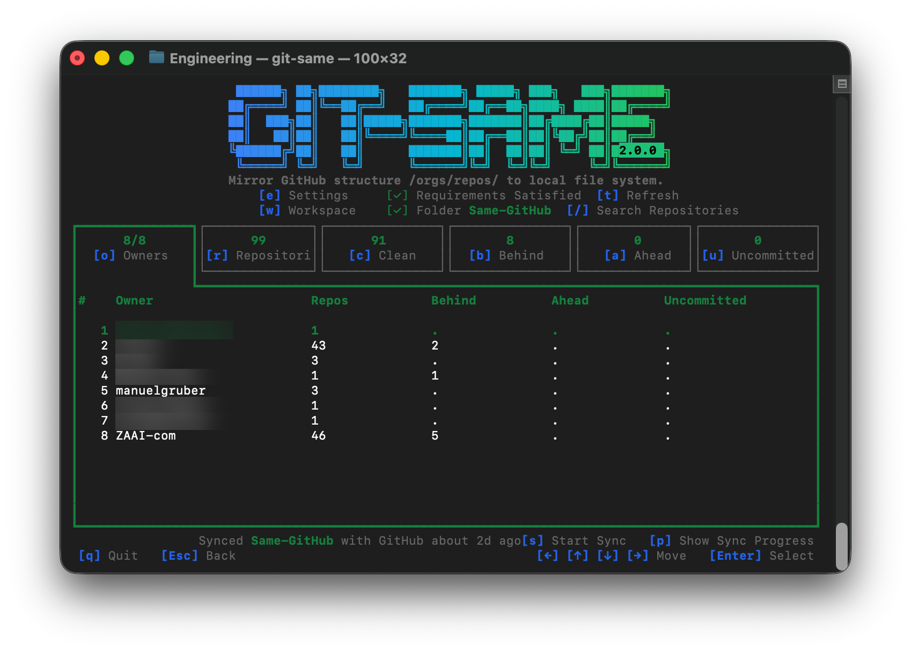
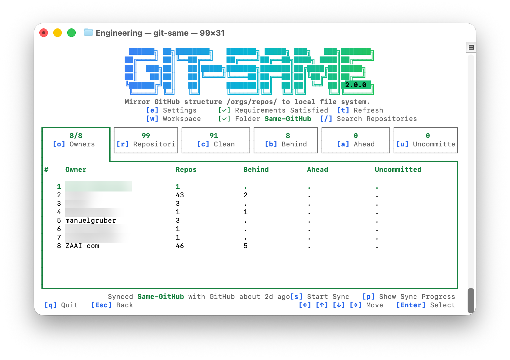
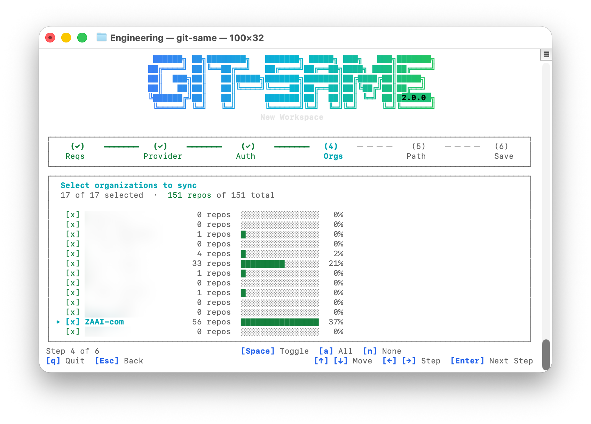
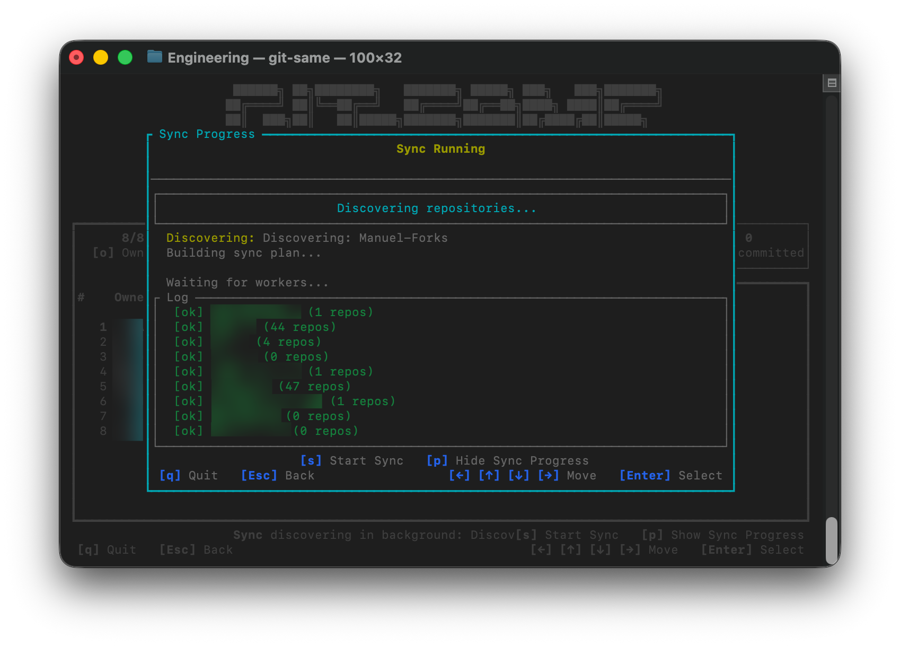
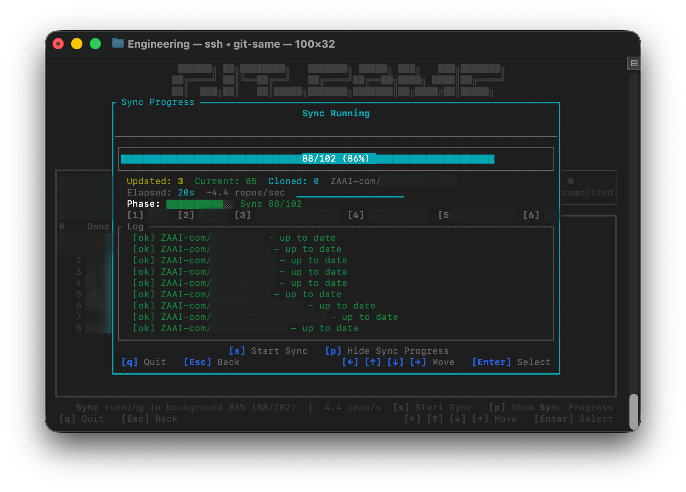
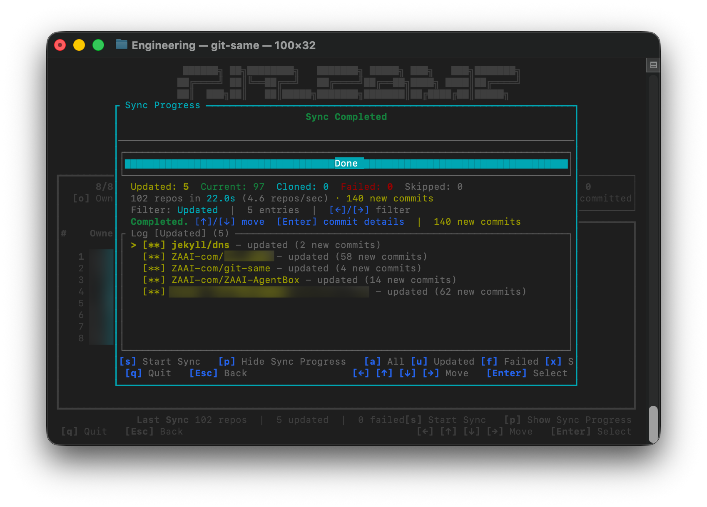
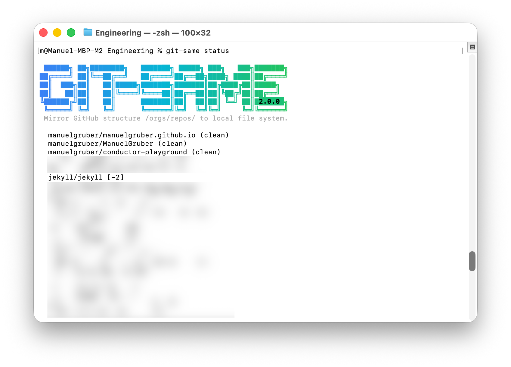

# Git-Same

Mirror your GitHub org structure to the local filesystem: parallel clone, incremental sync, TUI dashboard.

|  |
|:---:|

|  |
|:---:|

## What It Does

```
+--------------------------------------+------------+------------------------------------+
│ GITHUB PLATFORM                      │    Sync    │ LOCAL FILE SYSTEM                  │
│ github.com                           │            │ /users/m/same-github/              │
+--------------------------------------+------------+------------------------------------+
│ github.com/manuelgruber              │   <<==>>   │ manuelgruber/                      │
│ github.com/manuelgruber/.github      │   <<==>>   │ manuelgruber/.github/              │
│ github.com/manuelgruber/dotfiles     │   <<==>>   │ manuelgruber/dotfiles/             │
+--------------------------------------+------------+------------------------------------+
│ github.com/zaai-com                  │   <<==>>   │ zaai-com/                          │
│ github.com/zaai-com/powernight       │   <<==>>   │ zaai-com/powernight/               │
│ github.com/zaai-com/clean-autofill   │   <<==>>   │ zaai-com/clean-autofill/           │
│ github.com/zaai-com/git-same         │   <<==>>   │ zaai-com/git-same/                 │
│ github.com/zaai-com/jekyll-aeo       │   <<==>>   │ zaai-com/jekyll-aeo/               │
+--------------------------------------+------------+------------------------------------+
│ github.com/company1                  │   <<==>>   │ company1/                          │
│ github.com/company1/example.ai       │   <<==>>   │ company1/example.ai/               │
+--------------------------------------+------------+------------------------------------+
│ 3 orgs · 7 repos                     │            │ 3 dirs · 7 repos                   │
+--------------------------------------+------------+------------------------------------+
```

One command discovers every repo across your GitHub orgs and mirrors them locally, cloning new repos in parallel, fetching updates for existing ones, and skipping repos with uncommitted changes.

## Installation

**macOS** (signed + notarized cask):

```bash
brew install --cask zaai-com/tap/git-same
```

**Linux and headless macOS** (formula):

```bash
brew install zaai-com/tap/git-same-cli
```

> As of 3.0.0, macOS distribution moved to a Homebrew Cask. The previous `brew install zaai-com/tap/git-same` formula path is deprecated on macOS and prints a notice that points at the cask. The cask is the seam for the upcoming Tauri GUI app and Finder badges, which arrive via `brew upgrade --cask git-same` with no second migration.

<details>
<summary>Other installation methods</summary>

#### From crates.io

```bash
cargo install git-same
```

#### GitHub Releases

Download pre-built binaries from [GitHub Releases](https://github.com/zaai-com/git-same/releases) for Linux (x86_64, ARM64), macOS (x86_64, Apple Silicon), and Windows (x86_64, ARM64). The macOS assets are signed and notarized tarballs (`git-same-<version>-<arch>-apple-darwin.tar.gz`).

</details>

## Quick Start

**Interactive (TUI)**

```bash
git-same
```

Launches the full terminal UI with dashboard, sync, status, and workspace management, all via keyboard shortcuts.

**CLI**

```bash
git-same init          # 1. Create user config
git-same setup         # 2. Configure workspace (interactive wizard)
git-same sync          # 3. Clone new repos, fetch/pull existing
git-same status        # 4. Check repo status across orgs
```

## Commands

| Command | Description |
|---------|-------------|
| `git-same init` | Create config file with sensible defaults |
| `git-same setup` | Interactive wizard to configure a workspace |
| `git-same sync` | Discover, clone new, fetch/pull existing repos |
| `git-same status` | Show git status across all local repos |
| `git-same workspace` | List workspaces, set default |
| `git-same reset` | Remove all config, workspaces, and cache |
| `git-same scan` | Discover repos without cloning or syncing |

### `git-same init`

Initialize git-same configuration:

```bash
git-same init [-p <config-path>] [-f | --force]
```

Creates a config file at `~/.config/git-same/config.toml` with sensible defaults.

### `git-same setup`

Configure a workspace (interactive wizard):

```bash
git-same setup [--name <NAME>]
```

Walks through provider selection, authentication, org filters, and base path.

|  |
|:---:|

### `git-same sync`

Sync repositories: discover, clone new, fetch/pull existing:

```bash
git-same sync [OPTIONS]

Options:
  -w, --workspace <WORKSPACE> Workspace to sync (path or unique folder name)
      --pull                  Use pull instead of fetch for existing repos
  -n, --dry-run               Show what would be done
  -c, --concurrency <N>       Number of parallel operations (1-32)
      --refresh               Force re-discovery (ignore cache)
      --no-skip-uncommitted         Don't skip repos with uncommitted changes
```

**Discovering repos**

|  |
|:---:|

**Cloning & fetching**

|  |
|:---:|

**Completed**

|  |
|:---:|

### `git-same status`

Show status of local repositories:

```bash
git-same status [OPTIONS]

Options:
  -w, --workspace <WORKSPACE> Workspace to check (path or unique folder name)
  -o, --org <ORG>...          Filter by organization (repeatable)
  -d, --uncommitted                 Show only repositories with uncommitted changes
  -b, --behind                Show only repositories behind upstream
      --detailed              Show detailed status information
```

|  |
|:---:|

### `git-same workspace`

Manage workspaces:

```bash
git-same workspace list              # List configured workspaces
git-same workspace default [WORKSPACE] # Set default workspace (path or unique folder name)
git-same workspace default --clear   # Clear default workspace
```

### `git-same reset`

Remove all config, workspaces, and cache:

```bash
git-same reset [-f | --force]
```

## Aliases

Git-Same installs multiple binary names so you can use whichever you prefer:

| Command    | Description                                    |
|------------|------------------------------------------------|
| `git-same` | Primary binary (always available)              |
| `gitsame`  | No-hyphen alias (symlink)                      |
| `gitsa`    | Short alias (symlink)                          |
| `gisa`     | Shortest alias (symlink)                       |
| `git same` | Git subcommand (requires git-same in PATH)     |

> **Install method differences:** Homebrew cask (`brew install --cask zaai-com/tap/git-same`) and the headless formula (`brew install zaai-com/tap/git-same-cli`) both install all aliases automatically. `cargo install git-same` installs only the primary binary.

All examples in this README use `git-same`, but any alias works interchangeably.

## Requirements

Git-Same depends on two external tools at runtime:

- **[`git`](https://git-scm.com/)** — Git-Same shells out to `git` for all repository operations — clone, fetch, pull, and status. Without it, no git operations can run.
- **[`gh`](https://cli.github.com/) (GitHub CLI)** — Git-Same calls `gh auth token` to obtain GitHub API tokens for repo discovery and `gh api user` to resolve your username. Without it, Git-Same cannot authenticate with the GitHub API.

### Installing and authenticating `gh`

```bash
# Install GitHub CLI
brew install gh  # macOS
# or: sudo apt install gh  # Ubuntu

# Authenticate
gh auth login

# Git-Same will now use your gh credentials
git-same sync
```

## TUI Mode

Running `git-same` without a subcommand launches the interactive terminal UI.

### Screens

| Screen | Purpose | Key bindings |
|--------|---------|-------------|
| **Dashboard** | Overview with stats, quick actions | `s`: Sync, `t`: Status, `w`: Workspaces, `?`: Settings |
| **Workspace Selector** | Pick active workspace | `[←] [↑] [↓] [→]`: Move, `Enter`: Select, `d`: Set default, `n`: New |
| **Init Check** | System requirements check | `Enter`: Check, `c`: Create config, `s`: Setup |
| **Setup Wizard** | Interactive workspace configuration | Step-by-step prompts |
| **Command Picker** | Choose operation to run | `Enter`: Run |
| **Progress** | Live sync progress with per-repo updates | `Esc`: Back when complete |
| **Repo Status** | Table of local repos with git status | `[←] [↑] [↓] [→]`: Move, `/`: Filter, `D`: Uncommitted, `B`: Behind, `r`: Refresh |
| **Org Browser** | Browse discovered repos by organization | `[←] [↑] [↓] [→]`: Move |
| **Settings** | View workspace settings | `Esc`: Back |

## Examples

### Sync all repositories in default workspace

```bash
git-same sync
```

### Sync with pull mode for a specific workspace

```bash
git-same sync --workspace work --pull
```

### Check which repositories have uncommitted changes

```bash
git-same status --uncommitted
```

### Dry run to see what would be synced

```bash
git-same sync --dry-run
```

## License

MIT License - see [LICENSE](../LICENSE) for details

## Roadmap

- [x] GitHub support
- [x] Parallel cloning
- [x] Smart filtering
- [x] Progress bars
- [x] Interactive TUI mode
- [x] Workspace management
- [ ] GitLab support
- [ ] Bitbucket support
- [ ] Repo groups
- [ ] Web dashboard

---

Building from source or contributing? See [DEVELOPMENT.md](DEVELOPMENT.md).
