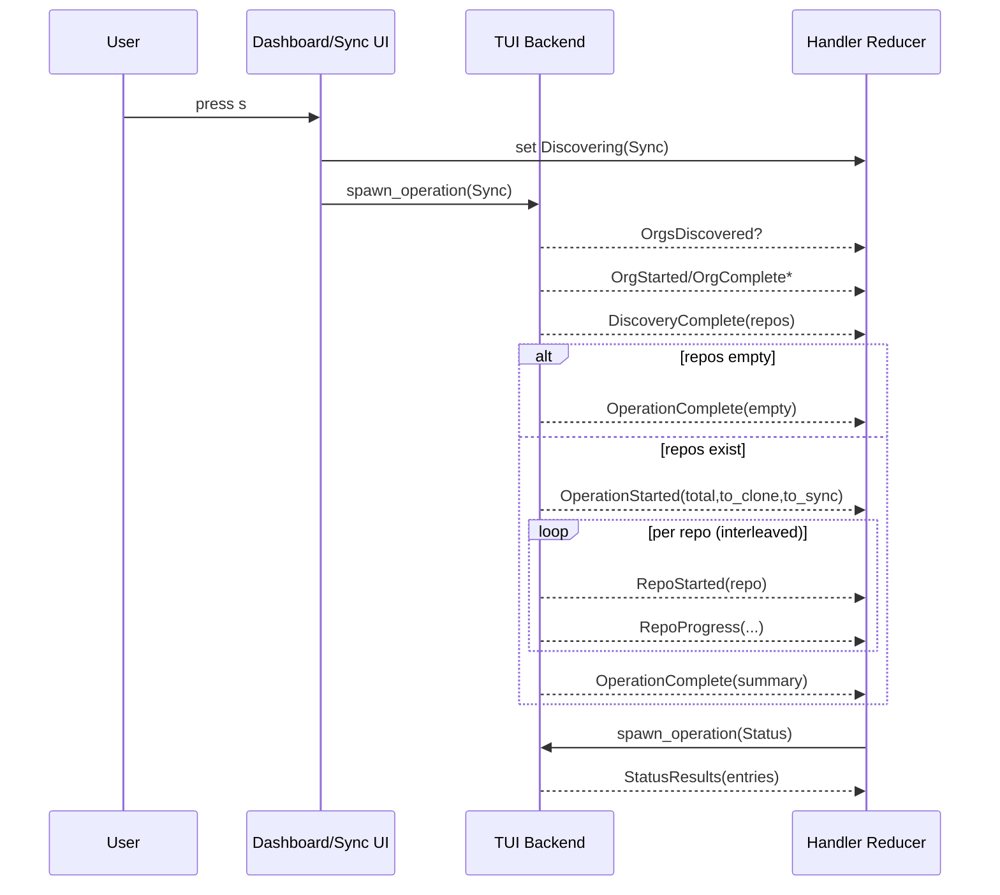

# Sync Screen Reference

Validated against commit `e889b4b` on 2026-05-07.

This is the implementation-level reference for the TUI Sync experience.

## What This Covers

- state machine and transitions (`Idle`, `Discovering`, `Running`, `Finished`)
- backend message contract and message ordering
- popup layout and per-line meaning
- keymap by state
- config and runtime precedence rules
- persistence side effects
- troubleshooting and known limitations
- test coverage map and testing gaps

## Source of Truth

Primary files:

- `src/tui/app.rs`
- `src/tui/event.rs`
- `src/tui/backend.rs`
- `src/tui/handler.rs`
- `src/tui/screens/sync.rs`
- `src/tui/screens/dashboard.rs`
- `src/tui/screens/settings.rs`
- `src/workflows/sync_workspace.rs`

## Quick Mental Model

- Sync work starts from Dashboard via `s`.
- Work runs in the background; Dashboard stays visible.
- Sync popup is opened/closed with `p`.
- Popup can show `Idle`, `Discovering`, `Running`, `Finished`.
- Backend emits typed messages; `handler.rs` reduces those into app state.

## Entry Points and Visibility

### Start sync

- Dashboard `s` calls `start_sync_operation()`.
- This sets `operation_state = Discovering { operation: Sync, message: "Starting Sync..." }` and spawns backend sync.
- Dashboard remains current screen.

### Show popup

- Dashboard `p` calls `show_sync_progress()`.
- Screen switches to `Screen::Sync` and current screen is pushed on `screen_stack`.

### Hide popup

- Sync `p` calls `hide_sync_progress()`.
- Returns to previous screen (typically Dashboard) without resetting sync state.

## State Machine

`OperationState` variants in `src/tui/app.rs`:

- `Idle`
- `Discovering { operation, message }`
- `Running { operation, total, completed, ... }`
- `Finished { operation, summary, ... }`

### Transition Matrix

| From | Trigger | To | Side effects |
|---|---|---|---|
| `Idle` | Dashboard/Sync key `s` -> `start_sync_operation()` | `Discovering(Sync)` | reset tick count, clear running log, spawn backend |
| `Discovering(Sync)` | `BackendMessage::OperationStarted` | `Running(Sync)` | clear structured log/filter selection, reset run counters |
| `Discovering(Sync)` | `BackendMessage::DiscoveryError` | `Idle` | set `error_message` |
| `Discovering(Sync)` | `BackendMessage::OperationError` | `Idle` | set `error_message` |
| `Discovering(Sync)` | `BackendMessage::OperationComplete` (empty repo path) | `Finished(Sync)` | default filter set, completion side effects |
| `Running(Sync)` | `BackendMessage::RepoStarted` | `Running(Sync)` | add repo to `active_repos` |
| `Running(Sync)` | `BackendMessage::RepoProgress` | `Running(Sync)` | increment counters, append structured + legacy log lines |
| `Running(Sync)` | `BackendMessage::OperationComplete` | `Finished(Sync)` | compute duration/metrics, persist timestamps/history, trigger status scan |
| `Running(Sync)` | `BackendMessage::OperationError` | `Idle` | set `error_message` |
| `Finished(Sync)` | key `s` | `Discovering(Sync)` | starts new run |
| any | key `p` (Dashboard/Sync) | same operation state | only screen visibility changes |
| any | key `q` | app exits | global immediate quit (`should_quit = true`) |

Notes:

- Starting a new operation while any operation is `Discovering` or `Running` is blocked with `error_message`.
- `Esc` in Sync first collapses expanded commit detail, then navigates back.

## Backend Message Contract

### Message table

| Message | Producer | Consumed in | Effect |
|---|---|---|---|
| `OrgsDiscovered(count)` | `TuiDiscoveryProgress::on_orgs_discovered` | `handle_backend_message` | sets discovering message |
| `OrgStarted(name)` | `TuiDiscoveryProgress::on_org_started` | `handle_backend_message` | sets discovering message |
| `OrgComplete(name, count)` | `TuiDiscoveryProgress::on_org_complete` | `handle_backend_message` | appends `[ok] org (N repos)` line |
| `DiscoveryComplete(repos)` | `run_sync_operation` | `handle_backend_message` | populates `orgs`, `repos_by_org`, `all_repos` |
| `DiscoveryError(msg)` | `TuiDiscoveryProgress::on_error` | `handle_backend_message` | move to `Idle` + error |
| `OperationStarted { operation, total, to_clone, to_sync }` | `run_sync_operation` | `handle_backend_message` | move to `Running`, reset per-run UI state |
| `RepoStarted { repo_name }` | clone/sync progress adapters | `handle_backend_message` | push active worker repo |
| `RepoProgress { ... }` | clone/sync progress adapters | `handle_backend_message` | update counters + log entries |
| `OperationComplete(summary)` | `run_sync_operation` | `handle_backend_message` | move to `Finished`, persist metadata/history |
| `OperationError(msg)` | `run_sync_operation` / `run_status_scan` | `handle_backend_message` | move to `Idle` + error |
| `RepoCommitLog { repo_name, commits }` | `spawn_commit_fetch` / `spawn_changelog_fetch` | `handle_backend_message` | update expanded repo commits or changelog aggregation |
| `StatusResults(entries)` | `run_status_scan` | `handle_backend_message` | refresh dashboard repo table |

### Ordering guarantees

Guaranteed ordering:

- `DiscoveryComplete` always occurs before `OperationStarted`.
- `OperationStarted` occurs before any run-phase `RepoProgress`.
- `OperationComplete` is emitted once per sync run.

Not guaranteed ordering:

- `RepoStarted`/`RepoProgress` across repos are interleaved due concurrency.
- `RepoCommitLog` messages for changelog mode are completion-order, not repo-order.

## Event-by-Event Sequence

### Compact text sequence

```text
User presses [s] on Dashboard
  -> local state set to Discovering(Sync)
  -> backend sync task spawned

Backend discovery
  -> OrgsDiscovered?
  -> OrgStarted/OrgComplete* (0..N)
  -> DiscoveryComplete(repos)

If repos.empty
  -> OperationComplete(empty summary)
  -> Finished
Else
  -> OperationStarted(total, to_clone, to_sync)
  -> RepoStarted/RepoProgress* (interleaved)
  -> OperationComplete(combined summary)
  -> Finished

On OperationComplete in handler
  -> update last_synced in workspace
  -> append/persist sync history
  -> default log filter (Updated or All)
  -> spawn status scan
  -> StatusResults
```

### Mermaid sequence diagram



## Popup UI Anatomy

The Sync screen is a centered popup (`80% x 80%`) with dimmed background.

Top-to-bottom rows:

1. Banner
2. Title line
3. Main progress gauge
4. Counters/summary line
5. Throughput/performance line
6. Phase/filter line
7. Worker/status line
8. Main log panel
9. Bottom actions + navigation hints

### Title meanings

- `Idle` -> `Sync Progress`
- `Discovering` or `Running` -> `Sync Running`
- `Finished` -> `Sync Completed`

### Progress gauge labels

- `Idle` -> `Press [s] to start sync`
- `Discovering` -> `Discovering repositories...`
- `Running` -> `completed/total (pct%)`
- `Finished` -> `Done`

### Line-by-line semantics by state

#### Idle

- counters line: `No sync activity yet.`
- throughput line: `Press [p] to hide, [s] to start.`
- worker line: `Use [p] to close this popup.`
- log panel: `No sync activity yet. Press [s] to start sync.`

#### Discovering

- counters line: `Discovering: <message>`
- throughput line: `Building sync plan...`
- worker line: `Waiting for workers...`
- log panel initially `Discovering repositories...`

#### Running

- counters line: Updated / Current / Cloned / optional Failed / optional Skipped / current repo
- throughput line: elapsed, repos/sec, optional ETA, optional sparkline
- phase line: clone bar and sync bar
- worker line: active repo slots or `Workers idle`
- log panel: color-coded lines from `app.log_lines`

#### Finished

- counters line: Updated / Current / Cloned / Failed / Skipped
- throughput line becomes performance line (repos, duration, repos/sec, optional commit and clone totals)
- phase line becomes filter status (active filter, entry count, left/right filter hint)
- worker line becomes navigation helper (`[Up]/[Down]`, `[Enter]`) and optional new-commit count
- log panel is filterable with optional inline expanded commit details

## Keymap

### Global keys (all screens)

- `q` -> immediate quit
- `Ctrl+C` -> immediate quit
- `Esc` -> navigate back (Sync special behavior: collapse expanded row first)

### Dashboard keys relevant to Sync

- `s` -> start Sync in background
- `p` -> open Sync popup

### Sync popup keys

Always available:

- `s` -> start Sync
- `p` -> hide popup

When `Discovering` or `Running`:

- `Up` / `Down` -> scroll running log
- `Left` / `Right` -> adjust running log scroll offset

When `Finished`:

- `Up` / `Down` -> move selected row (or scroll changelog view)
- `Left` / `Right` -> cycle filters (`All -> Updated -> Failed -> Skipped -> Changelog`)
- `Enter` -> expand/collapse selected repo commit details
- `a` -> All
- `u` -> Updated
- `f` -> Failed
- `x` -> Skipped
- `c` -> Changelog (batch commit fetch)
- `h` -> toggle sync history overlay

## Counter and Metric Glossary

| Name | Definition |
|---|---|
| `total` | `to_clone + to_sync` at run start |
| `completed` | incremented on each `RepoProgress` |
| `failed` | incremented when `success == false` |
| `skipped` | incremented when `skipped == true` |
| `cloned` | successful non-skipped entries with `is_clone == true` |
| `synced` | successful non-skipped entries with `is_clone == false` |
| `with_updates` | successful non-skipped entries where `had_updates == true` |
| `total_new_commits` | sum of `new_commits` where provided on updated entries |
| `current` (running UI) | `completed - failed - skipped - with_updates - cloned` |
| `current` (finished UI) | `summary.success - with_updates - cloned` |
| `changelog_total` | number of updated repos with resolvable path |
| `changelog_loaded` | count of `RepoCommitLog` received while in changelog mode |

## Config and Option Precedence Matrix

### Sync mode (fetch/pull)

Effective mode comes from `prepare_sync_workspace()`:

| Priority | Source | Rule |
|---|---|---|
| 1 | TUI runtime toggle `app.sync_pull` (`m` key) | if `true`, force `Pull` |
| 2 | Workspace config `workspace.sync_mode` | used when toggle is not forcing pull |
| 3 | Global config `config.sync_mode` | fallback |

Important nuance:

- `m` only flips `app.sync_pull` boolean.
- `false` means "do not force pull", not "force fetch".
- If workspace/global default is pull, mode can still be pull with toggle shown as Fetch in settings.

### Other sync knobs

| Concern | Effective source in TUI Sync | Notes |
|---|---|---|
| concurrency | `concurrency_override` (none in TUI) -> `workspace.concurrency` -> `config.concurrency` -> clamp 1..32 | resolved in `prepare_sync_workspace` |
| skip uncommitted | hard-coded `true` in TUI backend request | currently not user-tunable in popup |
| refresh discovery | hard-coded `true` in TUI backend request | discovery cache bypassed |
| create base path | hard-coded `true` in TUI backend request | missing base dir auto-created |
| dry run | hard-coded `false` in `execute_prepared_sync(..., false, ...)` | settings `dry_run` not wired |
| structure template | `workspace.structure` or `config.structure` | used for path resolution |
| clone options | workspace clone options override global clone options | depth/branch/submodules |

## Persistence and Side Effects

On `OperationComplete` (Sync):

- `last_synced` is set on active workspace (RFC3339).
- workspace is persisted via `WorkspaceManager::save`.
- sync history entry is appended and capped to 50 in memory.
- history is persisted via `SyncHistoryManager`.
- a status scan is auto-spawned to refresh Dashboard data.

Tick behavior:

- tick rate is 100ms.
- throughput sample added every 10 ticks (1 second).
- sampling continues even when Sync popup is hidden.

Status auto-refresh behavior:

- Dashboard periodic status scan is suppressed while sync is in progress.

## Troubleshooting

| Symptom | Probable cause | What to check | Recovery |
|---|---|---|---|
| Pressing `s` does not open Sync popup | expected behavior: sync runs in background | Dashboard bottom status line should show background sync | press `p` to open popup |
| Sync does not start and error appears | another operation already `Discovering` or `Running` | check `operation_state` summary in Dashboard footer | wait for current run to finish, then press `s` |
| Changelog stuck in loading view | waiting for `RepoCommitLog` events | verify run had updated repos with valid paths | switch filter away/back to `c`; retry sync |
| `Enter` on finished row shows nothing | selected entry has no computed `path` | inspect entry type/path computation/template | ensure workspace structure/provider mapping resolves existing local path |
| Unexpected pull behavior with settings showing Fetch | defaults can still request pull when not forced | compare workspace/global `sync_mode` values | set workspace/global mode explicitly, or force pull with `m` as needed |

## Known Limitations and Recommended Follow-ups

Current limitations:

1. TUI `dry_run` flag is not wired into Sync execution path.
2. TUI always requests `skip_uncommitted = true`.
3. `RepoProgress.skip_reason` is carried in messages but ignored in reducer/render.
4. Settings mode toggle can mislead because `sync_pull = false` means "use defaults", not guaranteed fetch.
5. Reducer coverage for `handle_backend_message` is still thin.

Recommended follow-ups:

1. Thread `app.dry_run` into backend call and `execute_prepared_sync`.
2. Add explicit skip-uncommitted toggle in settings/popup.
3. Render `skip_reason` in finished log rows and/or tooltip line.
4. Replace boolean `sync_pull` with explicit runtime mode enum (`Default`, `Fetch`, `Pull`).
5. Add focused reducer tests for message-to-state transitions.

## Testing Map

| File | What it covers today | Gaps |
|---|---|---|
| `src/tui/screens/sync_tests.rs` | popup hide (`p`), start sync (`s`), right-arrow filter cycle in finished state | no rendering assertions for counters/log variants/history/changelog |
| `src/tui/screens/dashboard_tests.rs` | dashboard starts sync in background, opens popup via `p`, show/hide preserves indices | no assertions for footer runtime text or background status content |
| `src/tui/backend_tests.rs` | discovery/clone/sync adapters emit expected messages; spawn errors without workspace | no full integration ordering test through real sync workflow |
| `src/tui/event_tests.rs` | enum/message construction and clone/debug sanity | no behavioral routing assertions |
| `src/tui/handler_tests.rs` | global quit and setup-wizard navigation basics | no direct tests for `handle_backend_message` sync reducer paths |

## User Journey Examples

### 1) Everything up to date

1. User presses `s` on Dashboard.
2. State: `Idle -> Discovering -> Running -> Finished`.
3. Most repo events are `success=true`, `had_updates=false`.
4. Finished counters show high `Current`, low/zero `Updated`, `Failed`, `Skipped`.
5. Performance line shows total repos, duration, repos/sec.

### 2) Mixed updates, clones, and failures

1. Run starts as usual.
2. Interleaved `RepoProgress` includes:
   - `Updated` entries (`[**]`)
   - `Cloned` entries (`[++]`)
   - `Failed` entries (`[!!]`)
3. Finished counters reflect all categories.
4. User can filter with `u`, `f`, `x`, or cycle via left/right.
5. `Enter` on a row fetches commit details; `c` shows aggregate changelog.

### 3) Discovery returns zero repos

1. Discovery completes with empty repo list.
2. Backend sends `OperationComplete(OpSummary::new())` without `OperationStarted`.
3. Handler still transitions to `Finished` with zeroed metrics.
4. Popup/log shows completion with no repo processing entries.

## Appendix: Exact Sync Request Values from TUI

When TUI starts Sync, it calls `prepare_sync_workspace()` with:

- `refresh: true`
- `skip_uncommitted: true`
- `pull: app.sync_pull`
- `concurrency_override: None`
- `create_base_path: true`

Then execution uses:

- `execute_prepared_sync(prepared, false, clone_progress, sync_progress)`

This is the exact reason dry-run and skip-uncommitted are currently fixed in TUI Sync.
